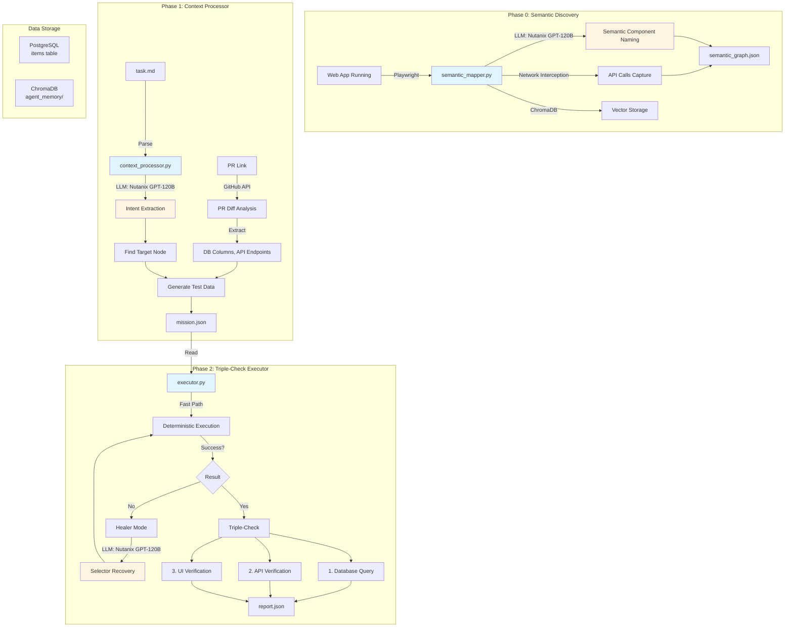
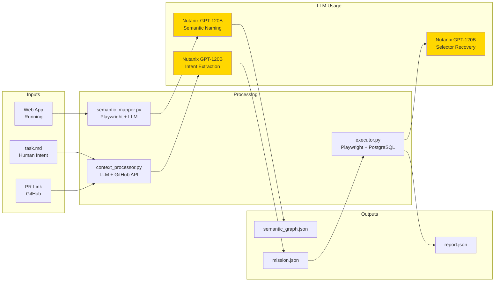
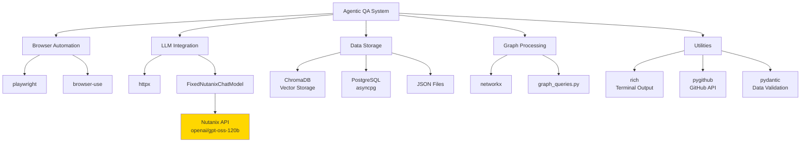
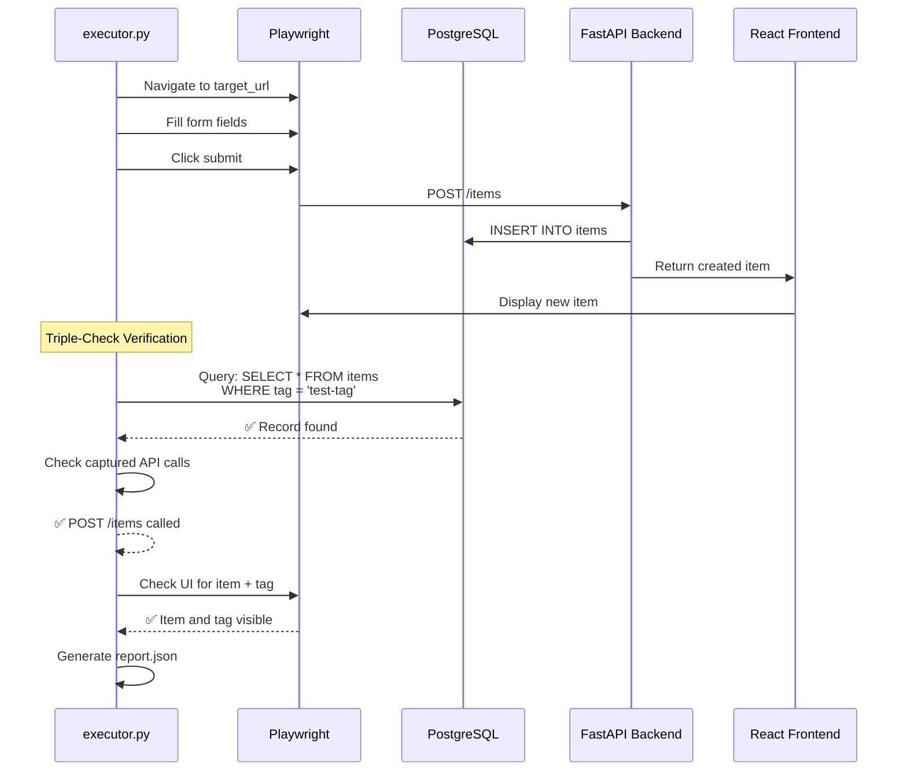
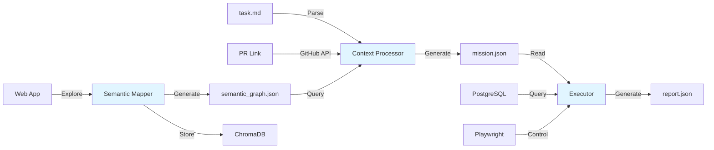

# Agentic QA System - Visual Architecture Diagram

## Mermaid Flow Diagram

## Component Interaction Diagram

## Library Dependencies Graph

## Triple-Check Flow

## LLM Usage Points

```mermaid
graph TB
    subgraph "1. Semantic Mapper"
        A1[DOM Structure] -->|Input| LLM1[Nutanix GPT-120B]
        LLM1 -->|Output| A2[Semantic Names<br/>create_item_form]
    end

    subgraph "2. Context Processor"
        B1[Task Description] -->|Input| LLM2[Nutanix GPT-120B]
        LLM2 -->|Output| B2[Structured Intent<br/>entity, changes, focus]
    end

    subgraph "3. Executor Healer"
        C1[DOM Snapshot<br/>Failed Selector] -->|Input| LLM3[Nutanix GPT-120B]
        LLM3 -->|Output| C2[New Selector<br/>Reasoning]
    end

    style LLM1 fill:#ffd700
    style LLM2 fill:#ffd700
    style LLM3 fill:#ffd700
```

## Data Flow

